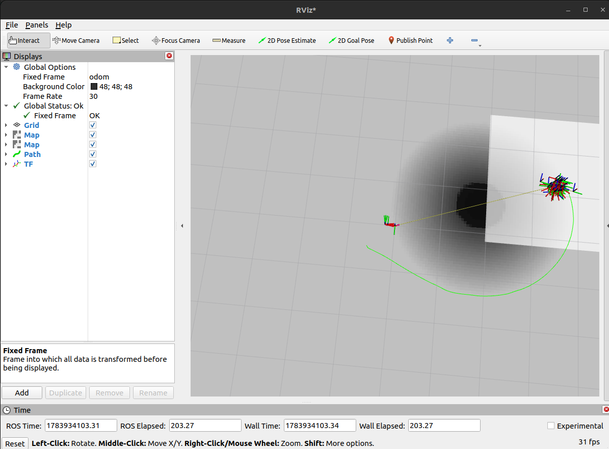
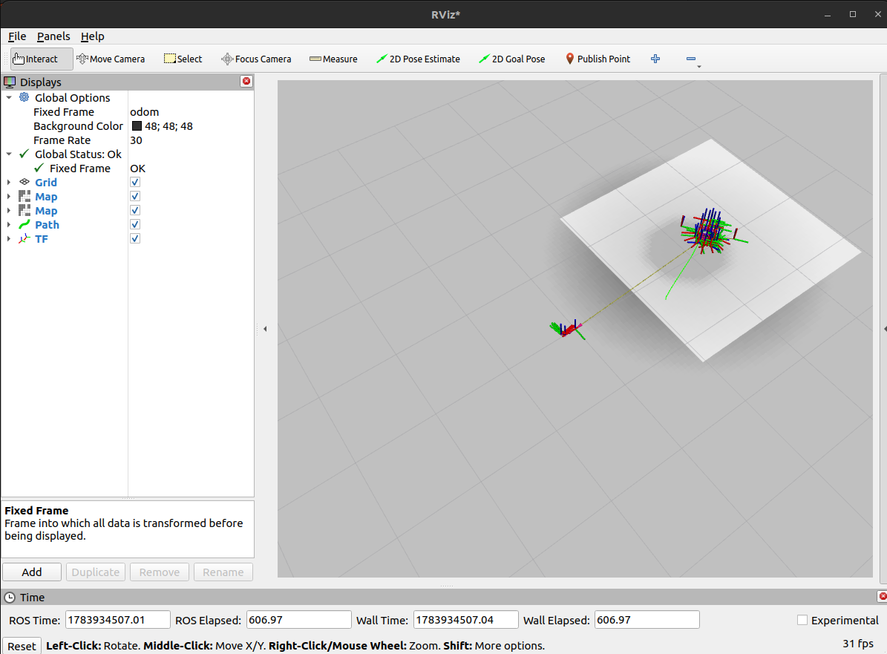
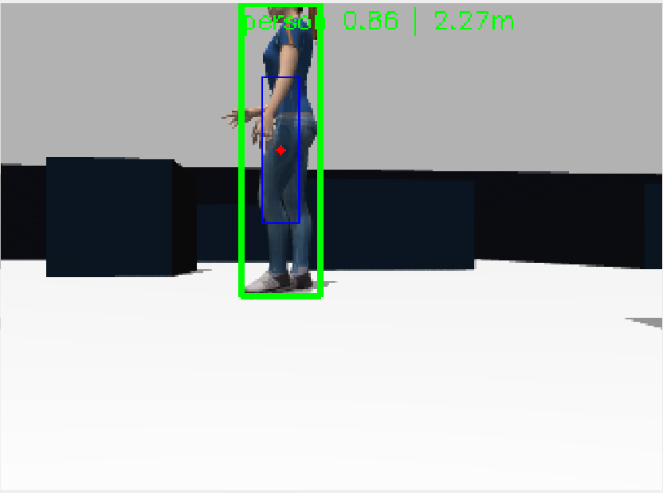

# semantic_nav

Class-conditional keep-out zones for ROS 2 Nav2, driven by camera-based object detection.

A LiDAR sees a person as an anonymous cylinder and inflates it by the robot's radius, exactly like a wall. This stack adds a costmap layer that knows the cylinder is a *person* — and treats it accordingly: a 2 m social-distance keep-out instead of a 0.45 m inflation, because people move unpredictably and the cost of hitting one is not comparable to brushing a wall.

Same planner, same LiDAR, same costmap. Different behaviour, because the robot now knows *what* the obstacle is.



---

## Table of contents

- [What it does](#what-it-does)
- [Result](#result)
- [Architecture](#architecture)
- [Packages](#packages)
- [Requirements](#requirements)
- [Installation](#installation)
- [Running](#running)
- [Debugging](#debugging)
- [Configuration](#configuration)
- [Design decisions](#design-decisions)
- [Known limitations](#known-limitations)
- [Things that bit me](#things-that-bit-me)
- [Roadmap](#roadmap)
- [Attribution](#attribution)

---

## What it does

1. A YOLO detector runs on the robot's RGB-D camera and finds objects that matter for navigation.
2. Each detection is back-projected to a 3D point using the depth image and the camera intrinsics, then transformed into the navigation frame.
3. A custom Nav2 costmap layer (C++, loaded via pluginlib) paints a class-conditional keep-out zone around each object: a lethal core for the body, then a cost gradient out to a per-class radius.
4. Objects decay: their confidence falls off with time since they were last seen, and they are forgotten entirely once it drops below a threshold. Nothing gets permanently burned into the map.

The detector is **stateless** — it reports only what it sees in the current frame. All temporal reasoning (persistence, decay, association) lives in the costmap layer. Keeping time-dependent logic in exactly one place is deliberate; see [Design decisions](#design-decisions).

---

## Result

The A/B test below is the point of the whole project. Same start pose, same goal, same LiDAR data. The only difference is whether the semantic layer is enabled.

| Semantic layer **enabled** | Semantic layer **disabled** |
|---|---|
|  |  |
| The person appears in the costmap as a lethal core with a falloff gradient. The planner routes wide around them. | The costmap is empty. The planner takes the direct line. |

Note the asymmetry in the enabled case: the robot passes walls at roughly the inflation radius (~0.45 m) but gives the person ~2 m. That gap *is* the semantic information — it does not exist anywhere in the LiDAR data.

---

## Architecture

```
  /oakd/rgb/preview/image_raw ─┐
  /oakd/rgb/preview/depth ─────┼──► semantic_nav_detector (Python)
  /oakd/rgb/preview/camera_info┘         │
                                         │  YOLO ──► bbox + class + confidence
                                         │  depth patch median ──► robust Z
                                         │  pinhole back-projection ──► 3D point
                                         │  TF (optical frame ──► odom)
                                         ▼
                            /semantic_objects
                            (SemanticObjectArray)
                                         │
                                         ▼
                    semantic_nav_costmap_plugins (C++)
                    loaded by pluginlib into Nav2
                                         │
                                         │  association (proximity, same class)
                                         │  confidence decay over time
                                         │  paint lethal core + falloff gradient
                                         │  merge with updateWithMax
                                         ▼
                    local_costmap  /  global_costmap
                                         │
                                         ▼
                                    Nav2 planner
```

Also published: `/semantic_debug_image`, an annotated RGB stream showing exactly what the detector saw and what it did with it.

---

## Packages

| Package | Build type | Contents |
|---|---|---|
| `semantic_nav_interfaces` | `ament_cmake` | `SemanticObject.msg`, `SemanticObjectArray.msg` |
| `semantic_nav_detector` | `ament_python` | YOLO detection, depth back-projection, TF, debug image |
| `semantic_nav_costmap_plugins` | `ament_cmake` | `SemanticLayer` — the Nav2 costmap plugin |
| `semantic_nav_bringup` | `ament_cmake` | Launch, params, world, RViz config |

**Why the split is not a style choice.** Nav2 costmap layers are loaded by pluginlib as shared libraries directly into the Nav2 process — a Python layer is not loadable at all, so `semantic_nav_costmap_plugins` *must* be C++. `semantic_nav_interfaces` must be `ament_cmake` because `rosidl` code generation is CMake-based. The detector is Python because `ultralytics` and `cv_bridge` are far more ergonomic there, and nothing about it needs to live in-process with Nav2.

### Message definition

```
# SemanticObject.msg
string  class_id       # COCO class name, e.g. "person"
geometry_msgs/Point position   # in the target frame (odom)
float32 confidence     # instantaneous detection confidence; the layer decays it
int32   track_id       # -1 == no identity (stateless mode)
float32 cost_radius    # metres; how far the keep-out zone extends
```

`track_id` is unused today but present so that switching the detector to `model.track(persist=True)` later is a message-compatible change. See [Roadmap](#roadmap).

---

## Requirements

- Ubuntu 22.04
- ROS 2 Humble
- Ignition Gazebo **Fortress** (`ros-humble-ros-gz`)
- TurtleBot 4 simulator (`ros-humble-turtlebot4-simulator`)
- Nav2 (`ros-humble-navigation2`, `ros-humble-nav2-bringup`)
- Python: `ultralytics`, `opencv-python`, `numpy`

Developed on an RTX 3050 Ti Laptop GPU (4 GB VRAM). See [Known limitations](#known-limitations) — the GPU budget shaped several design decisions.

---

## Installation

```bash
cd ~/semantic_nav_ws
colcon build --symlink-install
source install/setup.bash
```

`--symlink-install` is recommended: launch files, params and the world are then editable without rebuilding.

### The world symlink (required)

The world must be symlinked into the TurtleBot 4 worlds directory:

```bash
sudo ln -sf ~/semantic_nav_ws/install/semantic_nav_bringup/share/semantic_nav_bringup/worlds/semantic_maze.sdf \
            /opt/ros/humble/share/turtlebot4_ignition_bringup/worlds/semantic_maze.sdf
```

**Why this hack is necessary.** `turtlebot4_ignition.launch.py` resolves the world by *name*, searching `IGN_GAZEBO_RESOURCE_PATH`. It sets that variable with `SetEnvironmentVariable` — a full overwrite, not an append — and then starts Gazebo *inside the same include*. There is no point in our launch file where we can inject our own `worlds/` directory: setting it before the include gets overwritten, and setting it after is too late, because Gazebo has already been spawned. The symlink sidesteps the whole problem.

The clean alternative is to stop including `turtlebot4_ignition.launch.py` and instead include `ign_gazebo.launch.py`, `ros_ign_bridge.launch.py` and the robot spawn separately, controlling the environment ourselves. That is more code for no functional gain, so it has not been done.

If you delete `install/`, the symlink breaks — re-run the command above after a clean rebuild.

---

## Running

```bash
ros2 launch semantic_nav_bringup semantic_nav.launch.py
```

This brings up, in one command:

- Ignition Fortress with `semantic_maze.sdf` (a maze world with a person model)
- The TurtleBot 4 (camera, LiDAR, odometry)
- The semantic detector
- Nav2, with the semantic layer loaded into both costmaps
- RViz, preconfigured with both costmaps, the plan, the laser scan and the debug image
- An automatic undock + turn sequence, so the robot starts facing the person with its dock behind it

### Launch arguments

| Argument | Default | Purpose |
|---|---|---|
| `world` | `semantic_maze` | World name (no `.sdf`). `maze` / `warehouse` for the stock worlds. |
| `use_nav2` | `true` | Bring up Nav2. Set `false` to debug the detector alone. |
| `use_rviz` | `true` | Bring up RViz. |
| `params_file` | `params/semantic_detector.yaml` | Detector parameters. |
| `nav2_params_file` | `params/nav2_params.yaml` | Nav2 parameters (odom-frame, semantic layer). |

> **The Nav2 switch is called `use_nav2`, not `nav2`, on purpose.** `turtlebot4_spawn.launch.py` declares its own launch argument called `nav2`, and launch arguments propagate down into includes. An argument named `nav2` here leaks into the TurtleBot 4 include and makes it start a **second, independent Nav2 stack** with its own params — two of every node, fighting over the same topics and lifecycle transitions. TB4's `nav2` argument is therefore explicitly pinned to `false` in the launch file.

### Trying it

1. Wait for the undock + turn sequence to finish. The robot should end up looking at the person.
2. Confirm the person appears in the local costmap as a dark blob with a gradient around it.
3. Give a **2D Goal Pose** in RViz *behind* the person, so a straight line would drive through them.
4. Watch `/plan`.

To reproduce the A/B comparison, set `enabled: False` under `semantic_layer` in both costmaps in `nav2_params.yaml`, relaunch, and repeat with the same goal.

---

## Debugging

`/semantic_debug_image` shows exactly what the detector saw and what it decided:



| Colour | Meaning |
|---|---|
| **Green box** | Accepted. Went into the costmap. Label: `class confidence \| distance`. |
| **Blue box** | The depth patch — the pixels the median depth was taken from. |
| **Red dot** | The exact pixel fed into the back-projection. |
| **Grey box** | Detected, but the class is not in the whitelist. |
| **Yellow box** | Rejected: not enough valid depth pixels. The label gives the count. |

The blue patch is the single most useful thing on this image. If it is sitting on the wall behind the person rather than on their body, the depth is wrong and the object will land in the wrong costmap cell. The grey and yellow boxes exist because a detection that is silently `continue`d leaves no trace anywhere else — "why did this person not show up in the costmap?" is otherwise unanswerable.

Useful checks:

```bash
ros2 topic echo /semantic_objects          # what the layer is being fed
ros2 node list | sort | uniq -d            # duplicate node names == two stacks running
ros2 param get /global_costmap/global_costmap global_frame   # should be "odom"
ros2 run tf2_tools view_frames             # is odom connected to the camera?
```

---

## Configuration

### Detector (`params/semantic_detector.yaml`)

| Parameter | Default | Notes |
|---|---|---|
| `conf_threshold` | `0.4` | Passed straight to YOLO, which filters internally. |
| `class_list` | `['person', 'dog', 'cat']` | Whitelist. See below. |
| `class_radii` | `[2.0, 1.0, 1.0]` | Keep-out radius per class, metres. Parallel to `class_list`. |
| `target_frame` | `odom` | Frame the 3D points are published in. |
| `max_depth` | `10.0` | Metres. Depth is `32FC1`; a `16UC1` camera would be millimetres. |
| `min_valid_pixels` | `10` | Below this many valid depth pixels, the detection is dropped. |
| `publish_debug_image` | `true` | Costs nothing when off. |

**The whitelist is deliberately narrow, and not just "all 80 COCO classes."** A costmap cell means *do not drive here*, so the test for inclusion is "does this class change navigation behaviour?", not "can YOLO recognize it?" Three reasons the full COCO list is wrong:

- **Non-obstacles.** A `cell phone` or a `book` is not something the robot can collide with. Painting a keep-out zone around one makes the robot avoid empty floor.
- **Duplication.** `chair`, `table`, `couch` are physical obstacles the LiDAR *already sees*. Marking them again adds cost without adding information.
- **False positives.** Every extra class is another chance for a spurious detection to seal a corridor and strand the robot — the exact failure mode the decay exists to prevent.

The camera's contribution over the LiDAR is *class-conditional behaviour*, not raw obstacle detection. If you cannot defend a specific keep-out radius for a class, it does not belong in the list.

### Layer (`params/nav2_params.yaml`)

| Parameter | Default | Notes |
|---|---|---|
| `decay_time` | `3.0` | Seconds for confidence to fall to zero without a sighting. |
| `min_confidence` | `0.2` | Below this effective confidence, the object is forgotten. |
| `association_distance` | `0.75` | Same-class detections closer than this are treated as one object. |
| `lethal_core_radius` | `0.35` | Metres. Inside this, cells are hard-blocked. |

`decay_time` is the parameter you will most likely want to raise. At `3.0` s, the robot forgets a person almost as soon as it turns away from them — which is correct behaviour, but makes some tests awkward. `15.0`–`30.0` is reasonable for a static scene.

---

## Design decisions

### The detector is stateless; the layer owns time

The detector reports only what it sees in the current frame — no tracking, no memory, no decay. All temporal reasoning lives in the layer. If both components reasoned about time, they would eventually disagree about when an object stopped existing, and debugging that is miserable.

### Empty arrays are published, not withheld

When the detector sees nothing, it publishes an **empty** `SemanticObjectArray` rather than staying silent. This matters: silence is ambiguous. "No objects" and "the detector crashed" would look identical, and there would be no safe way for the layer to decide whether it is allowed to forget things. An empty array is a positive signal — *the camera is alive and currently sees nothing* — and it is what drives the decay.

### Per-object decay, not periodic costmap resets

The first design for the "robot gets stuck" problem was to wipe the costmap on a timer. That is the wrong tool:

- Nav2 already does this — the behaviour tree calls `ClearEntireCostmap` when it detects the robot is stuck, and the obstacle layer clears cells by raytracing.
- A global wipe deletes *real* obstacles that have not been re-observed yet, including a person standing outside the camera's current field of view.
- The actual question was never "how do I clear the map", it was "why does this cell stay lethal?" — and the answer was that a custom layer has to implement its own clearing. Standard layers raytrace; ours decays.

Per-object confidence decay solves it precisely: fresh detections reset the clock, stale ones fade out, and nothing else is touched.

### `updateWithMax`, and a `NO_INFORMATION` default

The layer derives from `CostmapLayer`, not `Layer`, so it gets its own grid which is then merged into the master costmap with `updateWithMax` — meaning it can only ever *raise* a cell's cost, never lower it. Writing straight into the master grid would let a person's soft social buffer erase a hard LiDAR obstacle standing behind them: silent, and dangerous.

The layer's own grid defaults to `NO_INFORMATION`, not `FREE_SPACE`. `updateWithMax` skips `NO_INFORMATION` cells, so an unpainted cell means *this layer has no opinion here*. With a `FREE_SPACE` default we would instead be asserting that every cell we did not touch is drivable, and fighting the LiDAR layer over empty space.

### The social buffer is capped below lethal

Inside `lethal_core_radius` the cost is `LETHAL_OBSTACLE` — if we believe there is a person there at all, driving through them is never acceptable. Beyond it, the cost falls off linearly and is scaled by the object's current confidence, capped below lethal. That zone is a strong *preference*, not a wall. Making it lethal would let a single low-confidence detection seal a corridor and strand the robot.

### The layer re-touches its last bounds

Nav2 only recomputes the window a layer reports in `updateBounds`. A cell we stop reporting is a cell that never gets recomputed — so its old cost stays burned into the master grid forever, and the robot refuses to enter a space where someone merely *used* to be. The layer therefore re-touches the bounds it painted last cycle, even when the object that caused them is gone. This one detail is what makes the decay actually visible.

---

## Known limitations

**Odometry only — no SLAM, no localization.** Nothing publishes `map → odom`, so everything runs in the `odom` frame and `static_layer` is removed from both costmaps. (Leaving `static_layer` in is a nasty trap: it waits forever on `/map`, the costmap never becomes "current", and Nav2 silently refuses to activate with no useful error.) The global costmap is a 20×20 m rolling window rather than sizing itself from a static map. Odometry drift accumulates with no loop closure, so long traverses will degrade. Adding `slam_toolbox` means reverting those three changes.

**Latest-available TF instead of exact-stamp.** The sim runs at RTF ≈ 0.44 (4 GB VRAM, and the GPU is rendering both the RGB and depth cameras). Image timestamps arrive ahead of the newest available transform, so an exact-stamp TF lookup extrapolates into the future and fails on every single frame. Both the detector and the layer therefore request the *latest* transform.

The cost is a pose error while the robot is moving. **Measured:** at 0.3 rad/s with the person 2 m away, a stationary object's `odom` position stays within a ~10 cm band. That is well inside the 2 m keep-out radius and the decay refreshes objects continuously, so it does not matter here. On real hardware, or at RTF ≈ 1, revert to `rgb_msg.header.stamp` — the accuracy is free there.

**Association is by proximity, not identity.** The detector sends `track_id = -1`, so the layer decides whether a detection is "the same person as last frame" by looking for the nearest same-class object within `association_distance`. Two people standing closer together than that threshold will merge into one tracked object.

**Detection range is limited by resolution.** The OAK-D preview stream is 320×240. This is generous for a person at 2–3 m and forgiving on a 4 GB GPU, but small or distant objects will be missed.

**`enabled` is read once, at initialization.** Toggling the layer for an A/B comparison currently needs a params edit and a relaunch; it is not a live parameter.

**The dock is unavoidable.** The TurtleBot 4 sim always spawns its charging dock, offers no argument to disable it, and places it directly in front of the robot. The launch file works around this with an automatic undock + 180° turn, which puts the dock behind the robot and leaves a clear corridor. Timings in that sequence are wall-clock delays and will need adjusting if your RTF differs substantially.

---

## Things that bit me

Kept here because most of them produce misleading error messages, and because the debugging was the actual work.

**`tf2_ros.Buffer()` without `node=self` ignores `use_sim_time`.** The buffer silently builds its own system clock. The node then lives in sim time while its TF buffer lives in wall time, and every lookup fails with `Lookup would require extrapolation into the future` — with the two timestamps sitting in completely different eras. The fix is one keyword argument; finding it took hours, because the error message describes a symptom that looks like a latency problem.

**Sensor QoS on camera subscriptions is not optional.** The sim publishes camera topics as best-effort. A reliable subscriber never matches a best-effort publisher, and the failure is completely silent — no error, no warning, just no messages, ever.

**Launch arguments leak into includes.** `turtlebot4_spawn.launch.py` has its own `nav2` argument. Naming ours the same thing made TB4 start a second Nav2 stack. The symptoms — duplicate node names, `unknown goal response`, a global costmap demanding a `map` frame we never configured — point nowhere near the cause. `ps -eo pid,ppid,cmd` and noticing that both stacks shared a parent PID was what finally cracked it.

**`turtlebot4_navigation/nav2.launch.py` swallows `params_file`.** It wraps `nav2_bringup` in an `OpaqueFunction`, and the argument does not survive the hop — Nav2 silently falls back to TB4's own `nav2.yaml`. Calling `nav2_bringup/navigation_launch.py` directly fixes it, and loses nothing: the wrapper only added a namespace push (we have none) and a `scan` remap (our topic is already called `scan`).

**pluginlib class names use `::`, not `/`.** `semantic_nav_costmap_plugins/SemanticLayer` in the params file gets you `class ... does not exist` — while the error message itself helpfully lists the registered name, `semantic_nav_costmap_plugins::SemanticLayer`, one line below.

**`cv2.putText` rejects `thickness=-1`.** `-1` means "fill the interior", which is meaningful for a circle or a rectangle and meaningless for text. OpenCV responds with an assertion failure deep inside `PolyLine` that names neither `putText` nor `thickness`.

**Layer order in the costmap plugin list is significant.** `inflation_layer` must come *after* `semantic_layer`, or the lethal core we stamp for a person's body never gets inflated by the robot radius.

---

## Roadmap

- **Tracking.** Switch the detector to `model.track(persist=True)` (ByteTrack) and key the layer's decay on `track_id` instead of re-associating by proximity. The message field already exists; this is a small change that fixes the merged-people failure mode.
- **Make `enabled` a live parameter**, so the A/B comparison does not need a relaunch.
- **SLAM.** Add `slam_toolbox`, restore `map` as the global frame, and put `static_layer` back.
- **Velocity-aware radii.** A person walking towards the robot deserves a larger keep-out zone than a stationary one. Tracking is a prerequisite.
- **Real hardware.** Everything about the timing trade-offs above changes when RTF is 1.0.

---

## Attribution

Written by Emin Çağan Apaydın.

## License

MIT

The `semantic_nav_costmap_plugins` package (the C++ Nav2 layer) was written with AI assistance; I do not write C++. The architecture, the design decisions documented above, and the debugging were mine, and the code is commented accordingly. Everything else — the detector, the message definitions, the integration, the debug tooling — I wrote myself.

I would rather say this plainly than have someone find out in an interview.
